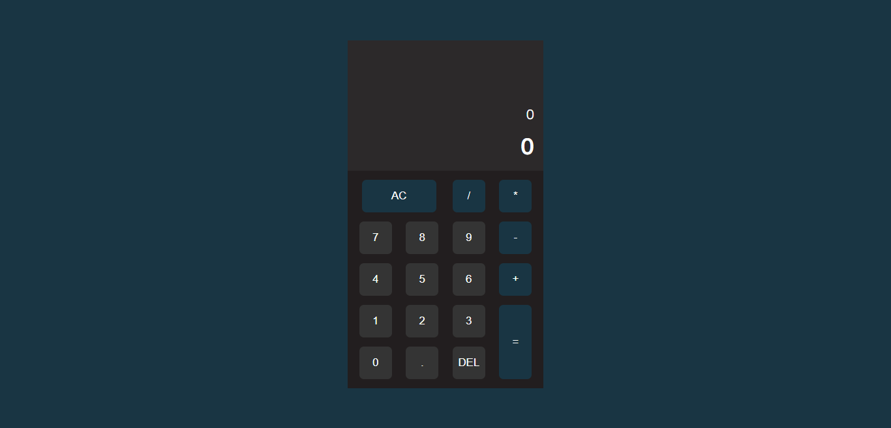

# Javascript Calculator

## SKILLS

- Props
- Functional Components
- useState
- useRef
- useEffect
- Regex
- Rendering Lists
- Responsive
- HTML
- Sass
- CSS
- Javascript
- React
- Vite
- Standard (ESLINT)

---
## LINKS

- Live Site URL: https://andr3sc0des.github.io/javascript-calculator

---